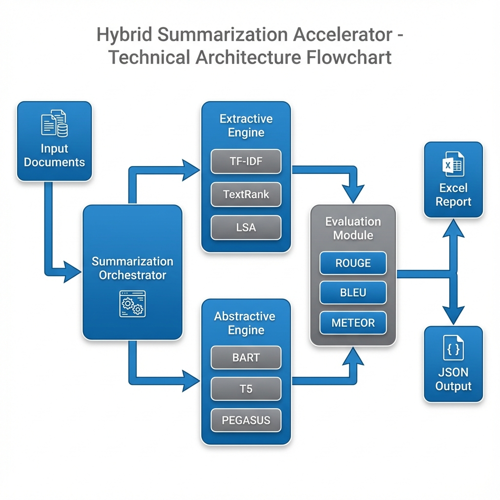

# Hybrid Summarization Accelerator Documentation

## 1. Objective
The **Hybrid Summarization Accelerator** is a comprehensive text summarization tool designed to automate the generation and evaluation of summaries using both extractive and abstractive techniques. Its primary goal is to provide users with a "best of both worlds" approach: identifying key sentences from the original text (Extractive) while also generating human-like, concise abstracts using state-of-the-art Large Language Models (Abstractive). The tool also focuses on rigorous evaluation, providing detailed metrics (ROUGE, BLEU, METEOR) to quantitatively assess summary quality.

## 2. Solution Architecture - As-Is
The solution is built as a modular Python application with the following core components:




### Architecture Flow (Text Version)
```text
[Input Documents] 
       ⬇
[Summarization Orchestrator]
       ⬇
   +-----------+----------------------+
   ⬇                                  ⬇
[Extractive Engine]            [Abstractive Engine]
- TF-IDF                       - BART
- TextRank                     - T5
- LSA / LexRank                - PEGASUS
   ⬇                                  ⬇
   +-----------+----------------------+
               ⬇
       [Evaluation Module]
       - ROUGE-1/2/L
       - BLEU
       - METEOR
               ⬇
       [Output Generator]
       ⬇                ⬇
 [Excel Report]    [JSON / CLI]
```

### Diagram (Mermaid - Alternative)
```mermaid
graph TD
    A[Input Text/Documents] --> B[Summarization Accelerator (Orchestrator)]
    B --> C{Processing Engines}
    C -->|Extractive| D[Extractive Summarizers]
    D --> D1[TF-IDF]
    D --> D2[TextRank]
    D --> D3[LSA/LexRank]
    C -->|Abstractive| E[Abstractive Models]
    E --> E1[BART]
    E --> E2[T5]
    E --> E3[PEGASUS]
    D --> F[Evaluation Module]
    E --> F
    F -->|Metrics| G[ROUGE / BLEU / METEOR]
    F --> H[Output Generator]
    H --> I[Excel Report]
    H --> J[JSON / CLI Output]
```

*   **Orchestrator (`SummarizationAccelerator` class)**: The central controller that manages the workflow, calling extractive and abstractive modules and aggregating results.
*   **Extractive Engine (`ExtractiveSummarizers`)**: Implements algorithm-based summarization (TF-IDF, TextRank, LSA, LexRank) to select important sentences directly from the source.
*   **Abstractive Engine (`AbstractiveSummarizers`)**: Wraps Hugging Face Transformers to utilize deep learning models (BART, T5, PEGASUS) for generating new text.
*   **Evaluation Module (`SummarizationEvaluator`)**: Calculates performance metrics (ROUGE, BLEU, METEOR, Cosine Similarity) to grade the summaries.
*   **Interfaces**:
    *   **Web Dashboard (`app.py`)**: A Streamlit-based Enterprise UI for interactive usage, visualization, and traceability.
    *   **CLI (`cli.py`)**: For command-line execution and automation.
    *   **Python API**: For integration into other applications.
    *   **Excel Reporter**: Generates detailed analysis reports (`full_summarization_report.xlsx`).

## 3. Getting Started
Steps for a new user to start using the accelerator:

### Prerequisites
*   **Python 3.8+** installed on the system.
*   (Optional) **NVIDIA GPU** with CUDA for faster abstractive summarization.

### Installation
1.  **Clone the repository** (or download source files).
2.  **Create a virtual environment** (recommended):
    ```bash
    python -m venv venv
    venv\Scripts\activate  # Windows
    # source venv/bin/activate  # Mac/Linux
    ```
3.  **Install dependencies**:
    ```bash
    pip install -r requirements.txt
    ```
4.  **Download NLTK data** (run once):
    ```bash
    python -c "import nltk; nltk.download('punkt')"
    ```

### Running the Web Dashboard (RECOMMENDED)
To launch the interactive user interface:
```bash
streamlit run app.py
```

### Running the Excel Demo
To generate a full report with sample data (headless):
```bash
python excel_demo.py
```
This will create `full_summarization_report.xlsx` in the same directory.

### Summarizing Your Own File
To summarize a specific text file:
```bash
python cli.py -f "path/to/your_document.txt"
```

## 4. Tech Stack Used
*   **Language**: Python 3.8+
*   **Core Logic**: `numpy`, `networkx` (Graph algorithms)
*   **NLP & ML Libraries**:
    *   `transformers` (Hugging Face) - For BART, T5, PEGASUS models.
    *   `torch` (PyTorch) - Deep learning backend.
    *   `nltk` - Natural Language Toolkit for tokenization.
    *   `sumy` - Library for standard extractive algorithms (LSA, LexRank, TextRank).
    *   `scikit-learn` - TF-IDF vectorization and cosine similarity.
    *   `sentence-transformers` - SBERT for semantic similarity and traceability.
*   **AI Services**:
    *   `google-genai` - Google Gemini for AI analysis and tone transfer.
*   **Web Framework**: `streamlit` - Interactive dashboard.
*   **Data Handling & Export**: `pandas`, `openpyxl`.
*   **Evaluation Metrics**: `rouge-score`, `sacrebleu`, `meteor`.

## 5. Features List

### Phase 1: Extractive Summarization (Statistical & Graph-based)
*   **TF-IDF Summarizer**: Scores sentences based on term frequency-inverse document frequency.
*   **TextRank**: Graph-based ranking algorithm (inspired by PageRank).
*   **Sumy Implementations**:
    *   **LexRank**: Graph-based centrality scoring.
    *   **LSA (Latent Semantic Analysis)**: Dimensionality reduction to find topics.
    *   **Luhn’s Algorithm**: Heuristic frequency-based scoring.

### Phase 2: Abstractive Summarization (Deep Learning)
*   **BART (Facebook)**: Encoder-decoder model excellent for denoising and text generation.
*   **T5 (Google)**: Text-to-Text Transfer Transformer, versatile for various NLP tasks including summarization.
*   **PEGASUS (Google)**: Specifically pre-trained for abstractive text summarization (Gap Sentence Generation).

### Phase 2 (Current) - Enterprise Features

#### 1. Smart Analysis & Recommendations
*   **Dynamic Model Recommendations**: Automatically identifies the best model for different use cases:
    *   **Best for Accuracy**: Highlights the model with highest ROUGE score for fact-retention.
    *   **Best for Speed**: Identifies the fastest model for batch processing.
    *   **Best for Brevity**: Shows which model compresses text most effectively.
*   **User-Friendly Explanations**: Each recommendation includes:
    *   Why this model won
    *   What the metric means in plain English
    *   When to use this model in production
*   **Glossary**: Built-in guide explaining technical metrics (ROUGE, BLEU, Cosine Similarity) for non-technical users.

#### 2. Production-Grade Traceability
*   **Semantic Source Mapping**: Uses SBERT (Sentence-BERT) embeddings to map each summary sentence back to its source in the original document.
*   **Multi-Model Support**: View traceability for both extractive AND abstractive models via dropdown selector.
*   **Position Indicators**: Shows the exact position (sentence index) of the source text.
*   **Visual Confidence Scores**: Color-coded similarity badges:
    *   🟢 Green: High Match (>80% similarity)
    *   🟡 Yellow: Moderate Match (50-80%)
    *   🔴 Red: Low Match (<50%)
*   **CSV Export**: Download traceability mappings for audit trails or further analysis.

#### 3. AI-Powered Tone Transfer (Gemini Integration)
*   **Style Transformation**: Rewrite summaries in different tones/styles:
    *   Formal (Business Language)
    *   Casual (Conversational)
    *   Bullet Points
    *   ELI5 (Explain Like I'm 5)
    *   Executive Summary (C-Suite Brief)
*   **AI Analysis**: Gemini provides strategic recommendations as a "Senior NLP Architect":
    *   Champion models for efficiency vs. readability
    *   Risk assessment (hallucinations, latency bottlenecks)
    *   Optimization strategies (e.g., "Use TF-IDF to pre-filter before BART")

### Other Key Features
*   **Multi-Metric Evaluation**: Automatically calculates ROUGE-1/2/L, BLEU, METEOR, and Cosine Similarity.
*   **Excel Reporting**: Exports a multi-sheet Excel file allowing side-by-side comparison of all methods.
*   **GPU Acceleration**: Automatically utilizes GPU if available for inference.

## 6. Application / Uses

### Core Use Cases
*   **Document Digitization**: Quickly getting the gist of scanned or OCR'd documents.
*   **Content Curation**: Generating short descriptions for long articles or blog posts.
*   **Legal/Financial Review**: Summarizing long contracts or reports to identify key clauses (using Extractive methods for fidelity).
*   **Meeting Minutes**: Processing transcripts to highlight key discussion points.
*   **News Aggregation**: Creating headlines or briefs from news streams.

### Enterprise Use Cases (Phase 2)
*   **Compliance & Audit**: Traceability feature ensures every summary sentence can be traced back to source for regulatory compliance.
*   **Multi-Channel Publishing**: Tone Transfer allows one document to be summarized in multiple styles (e.g., Executive Brief for C-suite, Casual for social media).
*   **Model Selection for Production**: Smart Analysis helps engineering teams choose the right model based on business constraints (speed vs. quality).
*   **Knowledge Base Extraction**: Abstractive models can rephrase technical docs into user-friendly FAQs.
*   **Customer Support Automation**: Generate quick case summaries with source citations for support agents.

## 7. Limitations / Edge Cases
*   **Input Length (Abstractive)**: Transformer models have a maximum token limit (e.g., 512 or 1024 tokens). Texts longer than this are truncated, potentially losing information at the end of long documents.
*   **Hallucination**: Abstractive models (like T5/BART) may occasionally generate plausible-sounding but factually incorrect details not present in the source text.
*   **Resource Intensity**: Running large models (like PEGASUS) requires significant RAM and preferably a GPU. CPU-only inference can be slow (several seconds per summary).
*   **Language Support**: Currently optimized for **English**. Other languages may require loading specific multilingual models.
*   **Domain Specificity**: General-purpose models may struggle with highly technical jargon (medical, legal) without fine-tuning.

## 8. Documentation - Timelines
*   **Current Status**: Complete functional documentation for Phase 1 & 2.
*   **Updates**: Documentation is updated alongside code releases.
*   **Next Review**: Scheduled for next major feature release (e.g., Phase 3: Domain adaptation or Long-document support).
